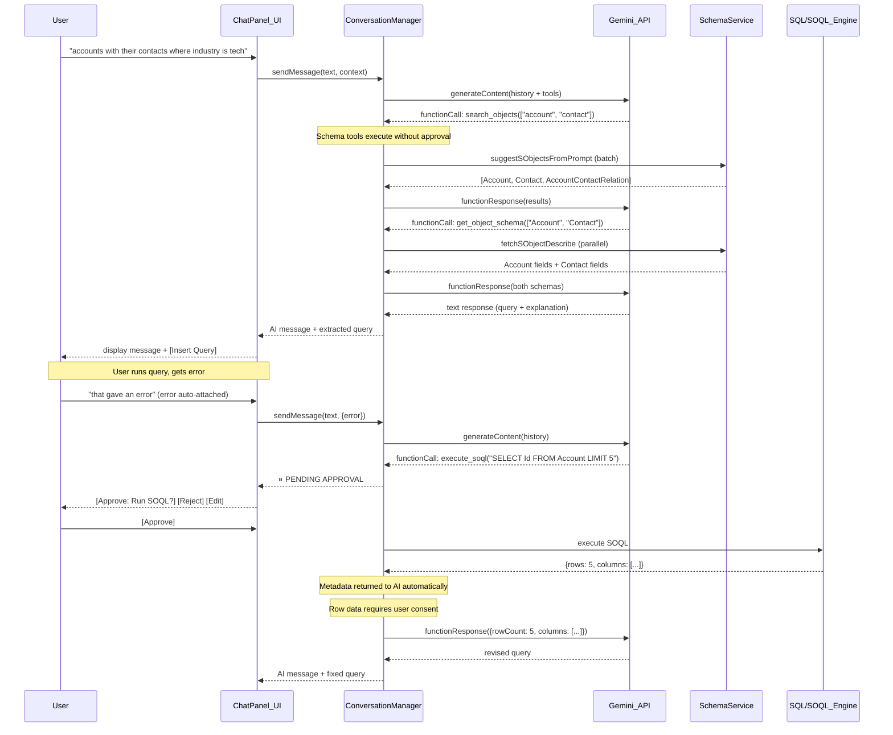

# Gemini Conversational Chat with Auto-Schema Discovery

## Problem

Currently, AI assistance is a single-shot modal (`AIAssistModal.js`) where the user must:

1. Type a prompt
2. Manually select schema objects from a list
3. Wait for generation
4. Insert the result

There is no conversation history, no ability to iterate ("no results, let's explore"), and no visibility into what the AI is doing with schema lookups. Critically, there is no way for the AI to *test* its own queries, explore data shapes, or debug join failures — the user must manually run the query, interpret errors, and feed them back.

## Architecture

Replace the modal flow with an inline chat panel + Gemini function calling. Gemini autonomously searches the org's schema, generates queries, and — with user approval — can test and debug them iteratively. All query execution and result sharing requires explicit user consent (unless auto-mode is enabled).




## Key Design Decisions

### 1. Gemini Function Calling for Schema Discovery and Query Testing

Define four tool declarations. Schema tools execute freely; query execution tools require user approval (unless auto-mode is on).

**Schema tools (no approval required):**

- `**search_objects(queries: string[])**` — Fuzzy-searches the org's SObject list for each query term. Returns combined, deduplicated results. Backed by existing `suggestSObjectsFromPrompt()` and `fetchSObjectNames()` from [addon/ai/schema.js](addon/ai/schema.js). Zero API cost.
- `**get_object_schema(object_names: string[])**` — Fetches the full describe for multiple SObjects in parallel and returns all serialized field lists. Backed by existing `fetchSObjectDescribe()` + `serializeSObjectDescribe()` from [addon/ai/schema.js](addon/ai/schema.js). Uses describe API (not counted against query limits).

**Query execution tools (approval required):**

- `**execute_soql(soql: string, purpose: string)**` — Executes a single SOQL query against Salesforce and returns metadata (row count, column names, column types). The `purpose` parameter is a short explanation shown to the user in the approval card (e.g., "Check if Account has Industry field data"). Row data is only included if the user consents (see section 5). This enables granular debugging — testing individual CTEs, checking data existence, validating join columns.
- `**execute_query(sql: string, purpose: string)**` — Executes a full SQL-with-CTEs query through the complete pipeline (SOQL extraction, Salesforce fetch, SQLite load, final SQL execution). Same approval and result-sharing rules as `execute_soql`. This tests the assembled query end-to-end.

Both execution tools include a `purpose` field so the user sees *why* the AI wants to run a query before approving it.

Additionally, Gemini can emit **multiple `functionCall` parts in a single response turn** (parallel tool use). The `ConversationManager` handles this: execute all non-approval-required calls concurrently, queue approval-required calls for user consent, then send all `functionResponse` parts back in a single turn once resolved.

### 2. User Approval System

Every query execution goes through an approval gate. This is critical because:

- Each SOQL query consumes org API limits
- Query results may contain sensitive data (PII, financial data, etc.)
- The user should understand *what* and *why* before any query runs

**Approval flow:**

When Gemini calls `execute_soql` or `execute_query`, the `ConversationManager` pauses the function-call loop and emits a `pending-approval` event. The ChatPanel renders an **approval card**:

```
┌─────────────────────────────────────────────────────┐
│  🔍 AI wants to run a query                         │
│                                                     │
│  Purpose: Check if Contact records have AccountId   │
│                                                     │
│  SELECT Id, AccountId FROM Contact                  │
│  WHERE AccountId != null LIMIT 10                   │
│                                                     │
│  [✓ Approve]  [✗ Reject]  [✎ Edit]                 │
└─────────────────────────────────────────────────────┘
```

- **Approve**: Executes the query, returns metadata to the AI
- **Reject**: Returns `{ rejected: true, reason: "User declined" }` to the AI — Gemini must respect this and find another approach or ask the user
- **Edit**: Opens the query in an editable textarea within the card, user modifies and then approves

After execution, if the query returned rows, a second consent step controls whether row data is shared with the AI (see section 5).

**Auto-mode toggle:**

A toggle in the chat panel header enables **auto-mode**. When active:

- Query execution tools run without approval cards
- Result metadata (row count, columns) is shared automatically
- Row data still requires consent by default (configurable: auto-mode can optionally auto-share row samples)
- Visible indicator: `🔄 Auto-mode: ON` in the panel header
- An **iteration cap** (default: 5 queries per conversation turn) prevents runaway API usage
- A **cumulative budget display** shows queries used this session: `Queries: 3/5 this turn · 12 total`

When auto-mode is off, the AI can still *propose* queries — it just needs the user to approve each one.

### 3. Multi-Turn Conversation via `contents[]` Array

The Gemini REST API supports multi-turn by sending the full conversation history in the `contents` array:

```javascript
contents: [
  // Turn 1: user request
  { role: "user", parts: [{ text: "accounts with contacts..." }] },
  // Turn 2: model calls search with batch queries
  { role: "model", parts: [
    { functionCall: { name: "search_objects", args: { queries: ["account", "contact"] } } }
  ]},
  // Turn 3: app returns batch results
  { role: "user", parts: [
    { functionResponse: { name: "search_objects", response: { results: ["Account", "Contact", ...] } } }
  ]},
  // Turn 4: model fetches multiple schemas in one call
  { role: "model", parts: [
    { functionCall: { name: "get_object_schema", args: { object_names: ["Account", "Contact"] } } }
  ]},
  // Turn 5: app returns all schemas at once
  { role: "user", parts: [
    { functionResponse: { name: "get_object_schema", response: { schemas: { Account: "...", Contact: "..." } } } }
  ]},
  // Turn 6: model generates query
  { role: "model", parts: [{ text: "Here's your query: <sql>WITH accounts AS (...</sql>" }] },
  // Turn 7: user follow-up with auto-attached context
  { role: "user", parts: [{ text: "no results - can you explore why?\n\n[Current query]\nWITH accounts AS (...)\n\n[Error]\nnull" }] },
  // Turn 8: model proposes a diagnostic SOQL
  { role: "model", parts: [
    { functionCall: { name: "execute_soql", args: { soql: "SELECT COUNT() FROM Account WHERE Industry = 'Technology'", purpose: "Check if any accounts match the Industry filter" } } }
  ]},
  // Turn 9: user approved, result returned
  { role: "user", parts: [
    { functionResponse: { name: "execute_soql", response: { rowCount: 0, note: "Zero rows — the filter may be wrong" } } }
  ]},
  // Turn 10: model revises
  { role: "model", parts: [{ text: "The issue is the Industry filter — no accounts have 'Technology'. Let me check what values exist..." }] }
]
```

When Gemini returns **multiple `functionCall` parts in a single turn** (parallel tool use), the `ConversationManager` executes all non-approval calls concurrently, queues approval calls, then sends all `functionResponse` parts back in one turn once everything resolves.

**Conversation pruning:** After the conversation exceeds a token budget (configurable, default ~80K tokens), the `ConversationManager` compresses older turns:

- Schema tool-call exchanges (search + describe round-trips) are summarized into a compact note: `[Previously fetched: Account (67 fields), Contact (42 fields)]`
- Debug iteration sequences are collapsed: `[Debug: ran 4 queries, final result was 47 rows]`
- The most recent 4-5 exchanges are always kept verbatim
- The original user request is always preserved

A `ConversationManager.pruneHistory()` method handles this before each API call.

### 4. Chat Panel UI (Inline, Not Modal)

Replace the modal with a collapsible chat panel integrated into the SQL Query page. Key UI elements:

- **Message list**: Scrollable list of user/AI messages with streaming text display (tokens appear progressively as they arrive from Gemini)
- **Status indicators**: Real-time display of AI actions (e.g., "Searching for Account schema...", "Generating query...") using spinner → checkmark transitions
- **Approval cards**: Inline cards for pending query executions (see section 2) with Approve/Reject/Edit actions
- **Auto-context bar**: Persistent bar above the input showing what context will be sent with the next message (see section 5)
- **Insert button**: Each AI-generated query has an "Insert" button to populate the query textarea
- **Auto-mode toggle**: In the panel header, toggles autonomous query execution
- **Budget display**: Shows queries used this turn and total session count
- **New conversation button**: Resets conversation history for a fresh start
- **Input bar**: Text input at the bottom with send button

### 5. Context and Privacy Controls

Context flows in two directions — into the chat (what the AI sees) and out of query execution (what results the AI receives). Both need privacy controls because Salesforce orgs contain sensitive data.

#### Sending context TO the AI

The **auto-context bar** sits above the input and shows what will accompany the user's next message:

- **Current query** — Auto-attached whenever the query textarea has content. Shown as a chip: `📎 Current query`. Dismissible with (×). No privacy concern (it's the user's own query text).
- **Error** — Auto-attached whenever an error exists from the last execution. Shown as a chip: `📎 Error: INVALID_FIELD...`. Dismissible with (×). Generally safe (error messages don't contain row data).
- **Result sample** — **NOT auto-attached.** Requires explicit opt-in. A button `+ Attach results` appears when results exist. Clicking it shows a **preview modal/popover** displaying the exact rows that will be sent (first 5 rows), and the user confirms or cancels. Shown as a chip after confirmation: `📎 Results (5 rows)`. This is the critical privacy gate — the user sees exactly what PII/sensitive data would be sent to the Gemini API before it leaves the browser.

This design means: query and error context flow naturally (the user barely notices), but row data never leaves the browser without explicit, informed consent.

#### Receiving results FROM query execution

When the AI executes a query (via `execute_soql` or `execute_query`) and it succeeds:

1. **Metadata is returned automatically**: row count, column names, column types. This is always safe — it's structural information, not data.
2. **Row data requires a second consent step**: The ChatPanel shows a result card:

```
┌─────────────────────────────────────────────────────┐
│  ✓ Query returned 47 rows                           │
│  Columns: Id, Name, Email, Phone, AccountId         │
│                                                     │
│  Share sample rows with AI?                         │
│  (First 5 rows will be sent to Gemini API)          │
│                                                     │
│  Preview:                                           │
│  ┌─────────────────────────────────────────────┐    │
│  │ Name          │ Email           │ Phone     │    │
│  │ Jane Smith    │ jane@acme.com   │ 555-0101  │    │
│  │ Bob Jones     │ bob@foo.net     │ 555-0202  │    │
│  │ ...                                         │    │
│  └─────────────────────────────────────────────┘    │
│                                                     │
│  [Share with AI]  [Metadata only]                   │
└─────────────────────────────────────────────────────┘
```

- **Share with AI**: Sends metadata + first N rows to Gemini
- **Metadata only**: Sends only row count and column info (default)

In auto-mode, result metadata is shared automatically. Row data sharing in auto-mode is controlled by a sub-toggle: `Auto-share row samples: OFF` (default off, user must explicitly enable).

### 6. Schema Exploration, Clarifying Questions, and Debug Strategies

The current system instruction says "You MUST output ONLY the query text. No explanations." — this is **removed** for conversational mode. The new system instruction enables:

#### Natural Conversation

Gemini can explain its reasoning, ask questions, and describe what it found. The query-only constraint is preserved only for the query itself — wrapped in `<sql>...</sql>` tags so `extractQueryFromResponse()` can parse it from surrounding explanation text.

#### Relationship Exploration

When Gemini calls `get_object_schema`, the response includes `referenceTo` fields (e.g., `TransactionId type=reference ref=Transaction`). The instruction tells Gemini to follow these references to discover join paths and present options to the user when multiple paths exist.

#### Org Limit Conservation

The system instruction must include explicit rules for conserving org API limits:

```
## Org Limit Rules
Every SOQL query you execute costs API calls against the org's daily limits.
Be extremely conservative with query execution:

1. NEVER execute a query just to "see what happens" — always have a specific diagnostic purpose
2. USE LIMIT clauses on all exploratory queries (LIMIT 5 for data checks, LIMIT 1 for existence checks)  
3. PREFER COUNT() queries to check data volume before fetching rows (costs 1 API call vs potentially thousands with pagination)
4. REUSE information: if you already know Account has Industry values from a previous query, don't query it again
5. COMBINE checks: test multiple hypotheses in one query when possible (e.g., SELECT COUNT() FROM Account WHERE Industry = 'Technology' OR Industry = 'Tech')
6. RESPECT rejection: if the user rejects a query, do not propose a near-identical query — ask what they'd prefer instead
7. DECLARE your budget: at the start of a debug sequence, tell the user how many queries you estimate needing (e.g., "I'd like to run 2-3 diagnostic queries to isolate the issue")
```

#### Debug Decomposition Strategies

When the AI is debugging a failing or zero-result query, the system instruction prescribes specific strategies:

```
## Debug Strategies (when testing/debugging queries)

When a query fails or returns unexpected results, follow this priority order:

1. ANALYZE FIRST: Before executing anything, examine the error message and query structure. Many issues (typos, wrong field names, syntax errors) can be fixed by inspection alone.

2. DECOMPOSE — test individual CTEs:
   Use execute_soql to run the SOQL from individual CTEs separately.
   This isolates which data source is empty or erroring.
   Example: "Let me check if the Account CTE returns data on its own."

3. ISOLATE JOINS — remove joins one at a time:
   If all CTEs return data, the issue is likely in the JOIN.
   Propose a simplified version of the final SQL with one join removed.
   Example: "Let me remove the Opportunity join to see if Account-Contact works alone."

4. CHECK EXISTENCE — verify filter values:
   Use COUNT() queries with the same WHERE clause to check if matching data exists.
   Example: "SELECT COUNT() FROM Account WHERE Industry = 'Technology' LIMIT 1"

5. INSPECT JOIN KEYS — verify referential integrity:
   Check that the foreign key values in one table actually exist in the other.
   Example: "Let me check if Contact.AccountId values match actual Account.Id values."

6. WIDEN FILTERS — remove WHERE clauses:
   If data exists but filters exclude everything, suggest wider filters.
   Always explain what you're changing and why.

ALWAYS explain your reasoning to the user. Say what you suspect, what you're testing, and what you learned.
```

Example flow:

```
User: I want to see total journal entries by payment method

AI: [Searching objects: "journal entry", "payment method"...]
    [Found: JournalEntry, PaymentMethod, Transaction]
    [Fetching schema: JournalEntry, PaymentMethod, Transaction...]

    I found a few ways to connect JournalEntry to PaymentMethod:

    1. JournalEntry → Transaction (via TransactionId) → PaymentMethod
       (via PaymentMethodId on Transaction)
    2. JournalEntry → Account → PaymentMethod
       (via AccountId on JournalEntry, then PaymentMethods on Account)

    Which path makes more sense for your use case? Or should I explore
    the schema further?

User: option 1, via transaction

AI: <sql>WITH journal_entries AS (
      /* SOQL: SELECT Id, TransactionId, Amount FROM JournalEntry */
      SELECT * FROM journal_entries
    ),
    transactions AS (
      /* SOQL: SELECT Id, PaymentMethodId FROM Transaction */
      SELECT * FROM transactions
    ),
    payment_methods AS (
      /* SOQL: SELECT Id, Name FROM PaymentMethod */
      SELECT * FROM payment_methods
    )
    SELECT pm.Name AS PaymentMethod, SUM(je.Amount) AS TotalAmount, COUNT(*) AS EntryCount
    FROM journal_entries je
    JOIN transactions t ON je.TransactionId = t.Id
    JOIN payment_methods pm ON t.PaymentMethodId = pm.Id
    GROUP BY pm.Name</sql>
    
    [Insert Query]

User: that gives 0 results, not sure why
      📎 Current query  📎 Error: null

AI: Zero results usually means one of the joins is producing no matches. I'd like
    to run 2 diagnostic queries to isolate which join is the issue.

    ┌─────────────────────────────────────────────────────┐
    │  🔍 AI wants to run a SOQL query                    │
    │  Purpose: Check if JournalEntry has TransactionId   │
    │  SELECT Id, TransactionId FROM JournalEntry         │
    │  WHERE TransactionId != null LIMIT 5                │
    │  [✓ Approve]  [✗ Reject]  [✎ Edit]                 │
    └─────────────────────────────────────────────────────┘

User: [Approve]

AI: JournalEntry returned 5 rows with TransactionId populated. That join looks fine.
    Let me check the Transaction → PaymentMethod link:

    ┌─────────────────────────────────────────────────────┐
    │  🔍 AI wants to run a SOQL query                    │
    │  Purpose: Check if Transaction has PaymentMethodId  │
    │  SELECT Id, PaymentMethodId FROM Transaction        │
    │  WHERE PaymentMethodId != null LIMIT 5              │
    │  [✓ Approve]  [✗ Reject]  [✎ Edit]                 │
    └─────────────────────────────────────────────────────┘

User: [Approve]

AI: That returned 0 rows — Transaction records don't have PaymentMethodId populated
    in your org. The second join is the one failing.
    
    Let me check if there's another way to link to PaymentMethod...
    [Fetching schema: Transaction (expanded)...]
    
    I see Transaction has a `PaymentId` field (not PaymentMethodId). Let me
    update the query:
    
    <sql>WITH journal_entries AS (...)
    ...
    JOIN payment_methods pm ON t.PaymentId = pm.Id
    ...</sql>
    
    [Insert Query]
```

### 7. Streaming Responses

Text responses from Gemini should stream token-by-token for a responsive chat feel. The architecture:

- `**geminiStreamWithTools()**` in [addon/ai/gemini.js](addon/ai/gemini.js): Uses Gemini's `streamGenerateContent` endpoint via SSE. Emits incremental text chunks for text responses. For function-call responses, buffers the complete response (since they need to be processed programmatically).
- `**ConversationManager**` emits `text-delta` events as chunks arrive, and `text-complete` when the full response is received.
- `**ChatPanel**` renders text progressively with a blinking cursor indicator, similar to Cursor's streaming experience.

Function-call loop turns (schema lookups, query execution) are *not* streamed — they process in the background with status indicators. Only the final text response to the user streams.

### 8. Conversation Management

#### New Conversation

A "New conversation" button in the panel header clears history and starts fresh. The current query in the textarea is preserved (it's not part of the conversation state).

#### Conversation Pruning

The `ConversationManager` maintains a token budget (default ~80K). Before each API call, `pruneHistory()` compresses older turns:

- Function-call exchanges older than the last 5 user turns are summarized: `[Fetched schemas: Account, Contact, Transaction]`
- Debug sequences are collapsed: `[Tested 3 queries: final result was 47 rows after widening date filter]`
- The original user request and most recent 4-5 exchanges are always kept verbatim

## Files to Create/Modify

### New Files

- **[addon/ai/conversation.js](addon/ai/conversation.js)** — `ConversationManager` class
  - Manages `contents[]` history array with pruning
  - Handles the function-call loop: send request → collect `functionCall` parts → execute schema tools immediately, queue execution tools for approval → wait for approvals → send all `functionResponse` parts → repeat until text response
  - Defines tool declarations (`search_objects`, `get_object_schema`, `execute_soql`, `execute_query`)
  - `autoMode` flag controls whether execution tools skip approval
  - Per-turn iteration cap (default 5) and cumulative session query counter
  - Token budget tracking and `pruneHistory()` for conversation compression
  - Emits events: `status` (tool progress), `text-delta` (streaming), `text-complete`, `pending-approval` (query needs consent), `result-consent` (row data sharing), `budget-update` (query count changed)
  - Accepts callbacks: `executeQueryCallback`, `executeSoqlCallback` (provided by `Model`)
  - Exposes `sendMessage(text, context?)`, `approveExecution(id)`, `rejectExecution(id)`, `editAndApprove(id, newQuery)`, `consentToShareRows(id)`, `declineRowSharing(id)`, `getHistory()`, `setAutoMode(bool)`, `resetConversation()`
- **[addon/components/ChatPanel.js](addon/components/ChatPanel.js)** — React component
  - Message list with streaming text display (blinking cursor while streaming)
  - Status steps within AI messages (spinner → checkmark transitions)
  - Approval cards for `execute_soql`/`execute_query` calls (Approve/Reject/Edit)
  - Result consent cards with row preview (Share/Metadata only)
  - Auto-context bar above input (query chip, error chip auto-attached; results opt-in with preview)
  - "Insert query" buttons on AI responses containing `<sql>` blocks
  - Auto-mode toggle in panel header with budget display (`Queries: 2/5 this turn · 8 total`)
  - "New conversation" button
  - Input bar with send button

### Modified Files

- **[addon/ai/gemini.js](addon/ai/gemini.js)** — Add `geminiGenerateWithTools()` and `geminiStreamWithTools()`
  - `geminiGenerateWithTools()`: Accepts `contents[]` array + `tools[]`, returns full response including `functionCall` parts
  - `geminiStreamWithTools()`: Same but uses `streamGenerateContent` SSE endpoint, yields incremental text chunks for text responses, buffers function-call responses
  - Both handle the tool-call response format and error extraction
- **[addon/ai/schema.js](addon/ai/schema.js)** — Export `serializeSObjectDescribe` and `fetchSObjectDescribe` (currently internal)
  - These become the backing implementations for the Gemini schema tool functions
- **[addon/ai/prompts.js](addon/ai/prompts.js)** — Rewrite system instruction for conversational mode
  - Remove "output ONLY query text" constraint; allow natural conversation
  - Instruct Gemini to use tools to explore schema before generating queries
  - Instruct Gemini to follow `referenceTo` fields to discover relationship chains
  - Instruct Gemini to ask clarifying questions when multiple join paths or ambiguous interpretations exist
  - Instruct Gemini to wrap queries in `<sql>...</sql>` tags for extraction
  - Add **org limit conservation rules** (LIMIT clauses, COUNT() preference, reuse prior results, declare budget)
  - Add **debug decomposition strategies** (decompose CTEs, isolate joins, check existence, inspect join keys, widen filters)
  - Add **privacy awareness** instructions (never request more data than needed, explain why row data would help when requesting it)
  - Keep the existing `buildSystemInstruction(QueryKind.soql)` path unchanged (used by data-export)
- **[addon/sql-query.js](addon/sql-query.js)** — Integrate ChatPanel
  - Replace `AIAssistModal` usage with `ChatPanel` component
  - Add `ConversationManager` instance to `Model` class
  - Wire up `executeQueryCallback` (reuses `Model.executeSqlWithCTEs()`) and `executeSoqlCallback` (new: runs single SOQL via `sfConn.rest()`, returns metadata + optionally rows)
  - Provide context getters: `getCurrentQuery()`, `getCurrentError()`, `getResultSample(n)`
  - Keep the existing `AIAssistModal` import path working for [addon/data-export.js](addon/data-export.js)
- **[addon/sql-query.css](addon/sql-query.css)** — Chat panel styles
  - Message bubbles (user right-aligned, AI left-aligned)
  - Approval cards with action buttons
  - Result consent cards with row preview table
  - Auto-context bar with dismissible chips
  - Streaming text cursor animation
  - Auto-mode indicator and budget display
  - Status step animations (spinner → checkmark)

## Migration Note

The existing `AIAssistModal` in [addon/components/AIAssistModal.js](addon/components/AIAssistModal.js) is also used by `data-export.js` for SOQL generation. It will remain untouched for that use case. Only the SQL Query page gets the new chat experience.

## Security and Privacy Summary


| Data type                                         | Sent to Gemini?     | User consent required?              |
| ------------------------------------------------- | ------------------- | ----------------------------------- |
| User's typed messages                             | Yes                 | Implicit (they typed it)            |
| Schema metadata (object names, field definitions) | Yes                 | No (structural, non-sensitive)      |
| Current query text                                | Yes (auto-attached) | Dismissible before send             |
| Error messages                                    | Yes (auto-attached) | Dismissible before send             |
| SOQL/SQL query proposed by AI                     | Yes (for execution) | Approval card (Approve/Reject/Edit) |
| Query result metadata (row count, columns)        | Yes                 | Automatic after approved execution  |
| Query result row data                             | Only if consented   | Explicit consent with row preview   |


## Org Limit Budget Summary


| Action            | API cost                                                      | Controlled by         |
| ----------------- | ------------------------------------------------------------- | --------------------- |
| search_objects    | 0 (local fuzzy match)                                         | Always allowed        |
| get_object_schema | 1 describe call per object (not counted against query limits) | Always allowed        |
| execute_soql      | 1+ API calls (pagination)                                     | Approval or auto-mode |
| execute_query     | N API calls (1 per CTE with SOQL)                             | Approval or auto-mode |


Budget guardrails:

- Per-turn cap: 5 query executions (configurable)
- Session counter: visible in UI, warns at thresholds
- Prompt instructs Gemini to use COUNT() and LIMIT, declare estimated budget, and minimize round-trips
- Auto-mode respects the same caps; disables automatically if cap is hit mid-turn

