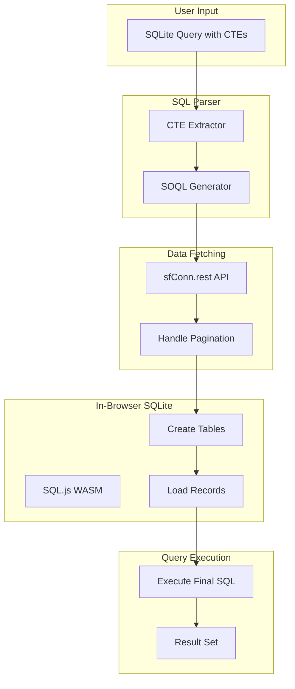

# SQLite Join Feature for Salesforce Inspector

## Overview

This feature addresses SOQL's limited join functionality by allowing users to write SQLite queries with CTEs that are automatically translated into SOQL extracts, loaded into an in-browser SQLite database, and then joined/filtered using standard SQL.

## Architecture




## CTE Syntax Design

Users write SQLite-compatible queries where CTEs represent Salesforce objects. Two approaches:

### Option A: Magic Comment Syntax (Recommended)

```sql
-- Each CTE includes a SOQL comment that specifies the extraction
WITH accounts AS (
  /* SOQL: SELECT Id, Name, Industry FROM Account WHERE Industry != null */
  SELECT * FROM accounts
),
contacts AS (
  /* SOQL: SELECT Id, FirstName, LastName, AccountId FROM Contact */
  SELECT * FROM contacts
)
SELECT a.Name, a.Industry, c.FirstName, c.LastName
FROM accounts a
JOIN contacts c ON a.Id = c.AccountId
WHERE a.Industry = 'Technology'
```

### Option B: Table Name Convention

```sql
-- CTE names map directly to Salesforce objects
-- Fields are inferred from CTE column references
WITH Account AS (SELECT Id, Name, Industry FROM Account),
     Contact AS (SELECT Id, FirstName, LastName, AccountId FROM Contact)
SELECT a.Name, a.Industry, c.FirstName, c.LastName
FROM Account a
JOIN Contact c ON a.Id = c.AccountId
WHERE a.Industry = 'Technology'
```

**Recommendation**: Option A (magic comments) provides explicit control and supports complex SOQL features (relationships, subqueries, WHERE clauses) that can't be inferred from SQL.

## Key Components

### 1. New Files to Create


| File                      | Purpose                             |
| ------------------------- | ----------------------------------- |
| `addon/sql-query.html`    | Main HTML page                      |
| `addon/sql-query.js`      | Core logic, Model, React UI         |
| `addon/sql-query.css`     | Page-specific styles                |
| `addon/lib/sql-wasm.js`   | SQL.js library (WebAssembly SQLite) |
| `addon/lib/sql-wasm.wasm` | SQL.js WASM binary                  |
| `addon/lib/sql-parser.js` | SQL parsing utilities               |


### 2. SQL Parser Module (`[addon/lib/sql-parser.js](addon/lib/sql-parser.js)`)

```javascript
// Core parsing functions
export function extractCTEs(sqlQuery) {
  // Returns: [{ name: 'accounts', soqlComment: 'SELECT...', columns: [...] }, ...]
}

export function getFinalQuery(sqlQuery) {
  // Returns the main SELECT statement after CTEs
}

export function validateSOQL(soql) {
  // Basic SOQL validation
}
```

### 3. SQLite Manager Module

```javascript
// addon/sql-query.js - SQLite operations
class SQLiteManager {
  constructor() {
    this.db = null; // SQL.js database instance
  }
  
  async init() {
    // Load SQL.js WASM
    const SQL = await initSqlJs({
      locateFile: file => `lib/${file}`
    });
    this.db = new SQL.Database();
  }
  
  createTable(tableName, columns, records) {
    // Infer column types from data
    // CREATE TABLE with appropriate schema
    // INSERT records
  }
  
  executeQuery(sql) {
    // Run final query, return results
  }
}
```

### 4. Query Execution Flow

```javascript
async executeJoinQuery(fullSql) {
  // 1. Parse SQL to extract CTEs with SOQL comments
  const ctes = extractCTEs(fullSql);
  const finalQuery = getFinalQuery(fullSql);
  
  // 2. Execute each SOQL query and load into SQLite
  for (const cte of ctes) {
    const soql = cte.soqlComment;
    const records = await this.fetchAllRecords(soql); // Uses existing sfConn.rest
    this.sqliteManager.createTable(cte.name, records);
  }
  
  // 3. Execute final SQL query
  const results = this.sqliteManager.executeQuery(finalQuery);
  
  // 4. Display results using existing RecordTable/scroll table
  return results;
}
```

## UI Design

The UI follows the existing `[data-export.html](addon/data-export.html)` pattern:

- **Header**: PageHeader component with navigation
- **Query Input**: Large textarea for SQL input (with syntax highlighting via Prism)
- **Execution Controls**: "Execute" button, "Cancel" button, Tooling API toggle
- **Status Panel**: Shows extraction progress (e.g., "Loading accounts... 1,500/3,200 records")
- **Results Table**: Reuse existing virtual scroll table from data-export
- **Export Options**: Copy as CSV/Excel/JSON, Download

### Progress Feedback

```
Parsing query... Done
Extracting accounts (SOQL)... 1,500/3,200 records
Extracting contacts (SOQL)... Done (5,000 records)
Loading into SQLite... Done
Executing join query... Done
Results: 2,847 records
```

## Dependencies to Add

### SQL.js (In-Browser SQLite)

- Source: [https://github.com/sql-js/sql.js](https://github.com/sql-js/sql.js)
- Files needed: `sql-wasm.js`, `sql-wasm.wasm`
- Size: ~1.2MB (WASM) + 100KB (JS)
- Load on-demand when SQL Query page is opened

### SQL Parser

- Option 1: Use regex-based parsing for CTE extraction (simpler, sufficient for magic comment syntax)
- Option 2: Use `node-sql-parser` if more complex parsing needed

## Manifest Changes

Add to `[manifest.json](addon/manifest.json)`:

```json
{
  "web_accessible_resources": [{
    "resources": [
      "sql-query.html",
      "lib/sql-wasm.js",
      "lib/sql-wasm.wasm",
      // ...existing resources
    ]
  }],
  "commands": {
    "sql-query": {
      "description": "SQL Query (Join)"
    }
  }
}
```

## Integration Points

### Reuse from Existing Code

- `sfConn.rest()` from `[inspector.js](addon/inspector.js)` - Salesforce API calls
- `RecordTable` pattern from `[data-export.js](addon/data-export.js)` - Result processing
- `initScrollTable` from `[data-load.js](addon/data-load.js)` - Virtual scrolling
- `PageHeader`, `Spinner`, `Toast` components
- Session management and authentication

### Data Export Link

- Add "Open in SQL Query" button to Data Export results
- Pre-populate CTE with current SOQL query and results

## Error Handling

- **SOQL Errors**: Display Salesforce API error messages (reuse existing pattern)
- **SQL Syntax Errors**: SQL.js provides detailed error messages
- **Type Mismatches**: Warn about join column type incompatibilities
- **Memory Limits**: Warn when loading very large datasets (configurable limit)

## Future Enhancements (Out of Scope)

- Query history/saved queries
- Schema browser for Salesforce objects
- Auto-complete for object/field names
- Visual query builder
- Export SQLite database file

